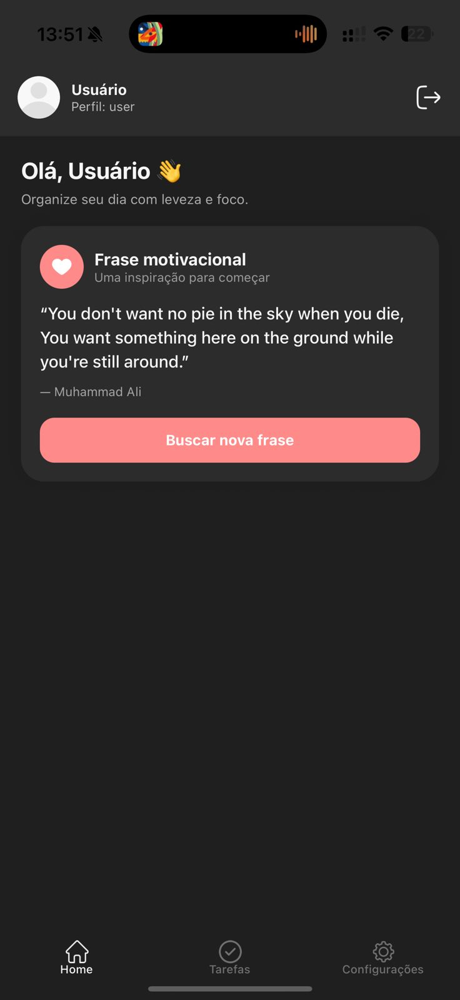
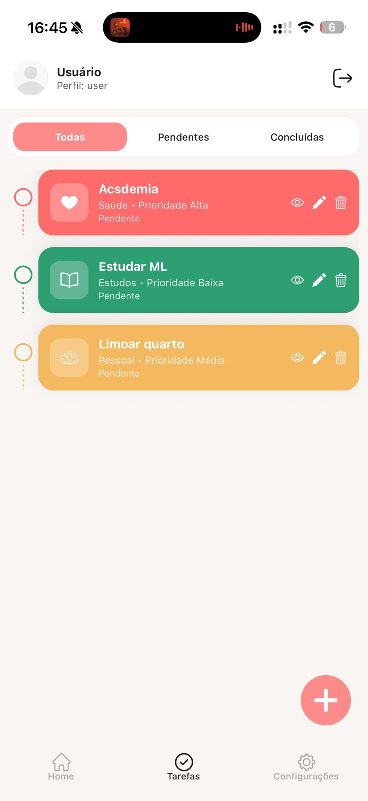
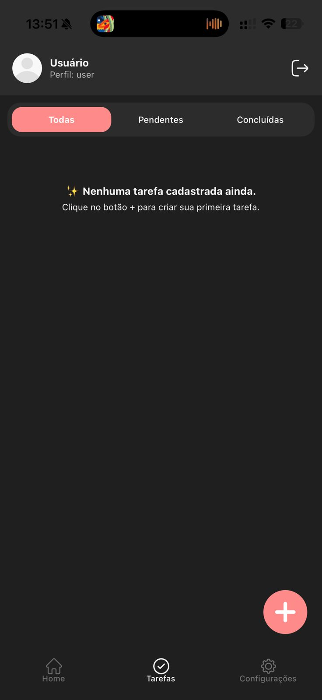
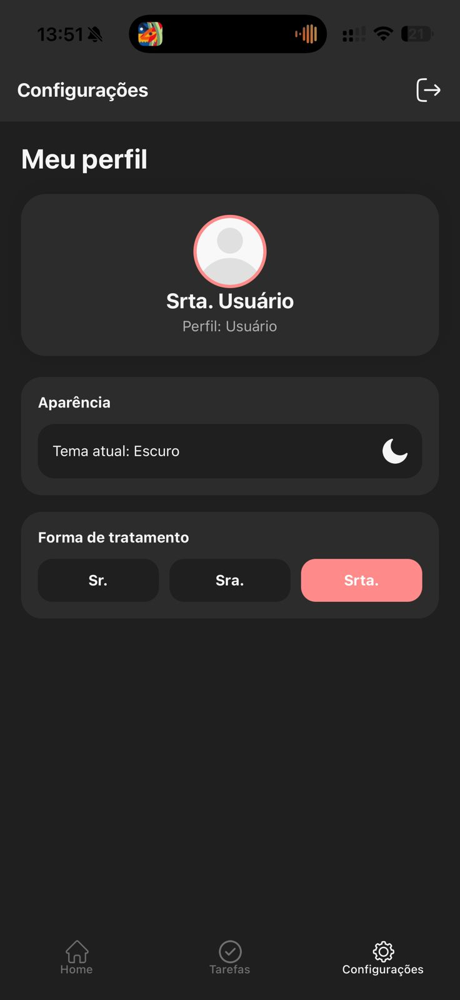

# 📱 TaskFlow App

O **TaskFlow** é um aplicativo mobile desenvolvido em **React Native com Expo**, criado com o objetivo de ajudar usuários a organizarem suas tarefas diárias de forma simples, intuitiva e com uma experiência visual moderna.

---

## 🎯 Objetivo

O projeto foi desenvolvido com foco em aplicar conceitos fundamentais de desenvolvimento mobile, incluindo:

- Gerenciamento de estado global (Context API)
- Persistência de dados (AsyncStorage)
- Navegação entre telas (React Navigation)
- Arquitetura organizada (components, hooks, services, types)

---

## 👥 Público-alvo

O TaskFlow é voltado para:

- Estudantes
- Profissionais
- Pessoas que desejam organizar sua rotina diária

O sistema possui dois perfis de acesso:

- 👨‍💼 **Administrador**
- 👤 **Usuário**

---

## 🔑 Credenciais de teste
Administrador:
usuário: admin
senha: 123

Usuário:
usuário: user
senha: 123

---

## ⚙️ Funcionalidades

### 🔐 Autenticação
- Login com validação de credenciais
- Exibição de erro para login inválido
- Persistência de sessão (AsyncStorage)
- Logout com limpeza de dados
- Navegação baseada no tipo de usuário:
  - Admin → Configurações
  - User → Home

---

### 📝 Gerenciamento de tarefas
- Criar tarefas
- Editar tarefas
- Excluir tarefas
- Marcar como concluída
- Filtrar tarefas por:
  - Todas
  - Pendentes
  - Concluídas
- Armazenamento separado por usuário

---

### 🎨 Interface e Experiência
- Tema claro e escuro 🌙☀️
- Interface moderna e responsiva
- Componentes reutilizáveis
- Animações suaves
- Compatibilidade com iPhone (SafeAreaView)

---

### 💾 Persistência de dados
- Uso do AsyncStorage
- Dados mantidos após fechar o app
- Recuperação automática da sessão do usuário

---

## 🧠 Arquitetura do Projeto
src/
├── components/
├── context/
├── hooks/
├── services/
├── routes/
├── screens/
└── types/

---

## 🎥 Demonstração

👉 (adicione aqui o link do seu vídeo depois)

---

## 📸 Screenshots

<p align="center">
  
  
  
  
</p>

---

## 🚀 Como executar o projeto

```bash
npm install
npx expo start
